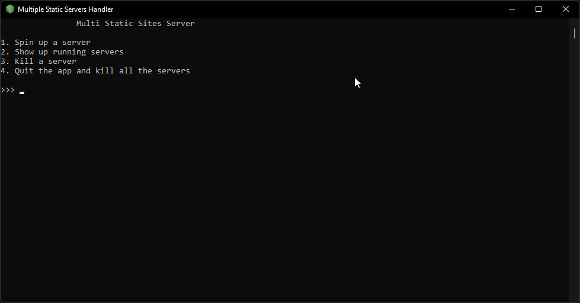
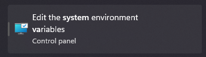
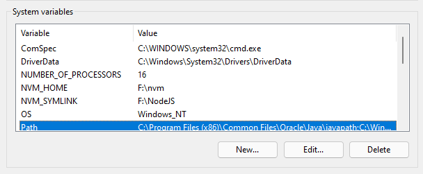
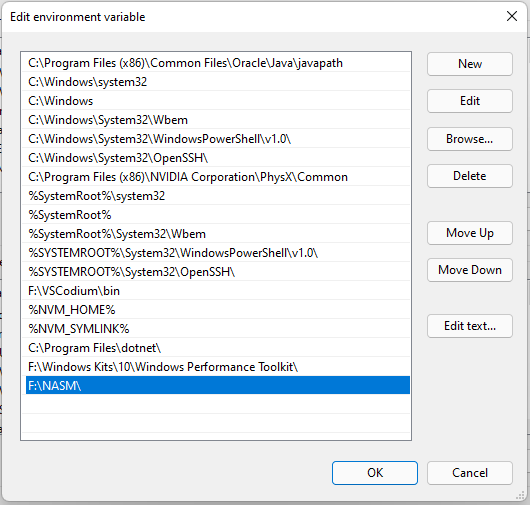
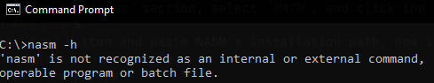
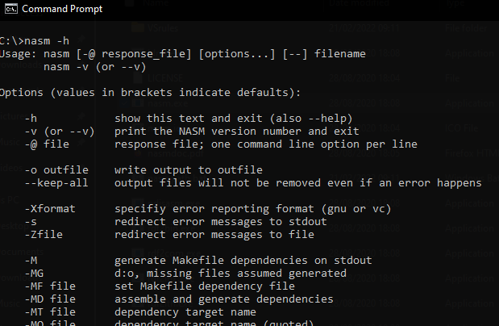
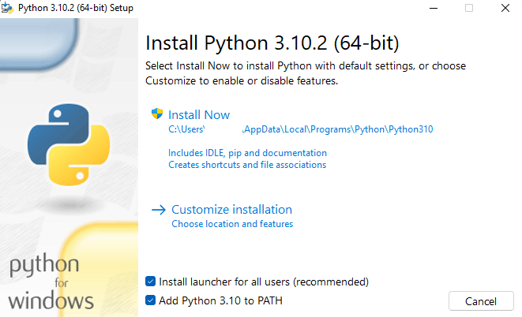
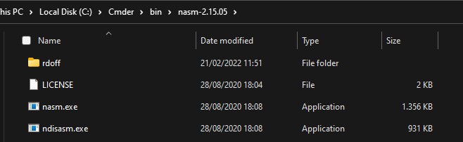
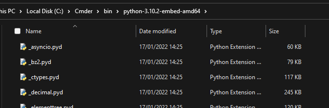

# Multi Server Handler 

CLI application written in JavaScript/Node that handles multiple servers allocated dynamically that are serving a static folder.

## Table of Contents 

-   [Introduction](#introduction)
-   [Table of Contents](#Table-of-Contents)
-   Usage
    -   [Run from Source](#run-from-source)
    -   Run as Standalone
        -   [Build from Source](#build-from-source)
        -   [Prebuilt Binaries](#pebuilt-binaries)
-   [How to Build](#how-to-build)
    -   [Requirements](#requirements)
        -   [NodeJS](#nodejs)
        -   [Multi Server Handler](#multi-server-handler)
    -   [Setting up the Build Enviroment on Windows](#setup-windows-build-enviroment)
        -   [For Cmder users](#cmder-setup)
-   [Build](#build)
-   [Todo](#todo)

<!-- -   [Setting up the Build Enviroment on Linux](#setup-linux-build-enviroment) !-->

# Usage

## Run from Source 

-   Clone the repo or download the zip file and extract it
-   Open a terminal inside the app folder
-   Run `npm install` or `yarn install`
-   Run `npm run start` or `yarn start`
-   Done!

## Run as Standalone

### Build from Source 

See [How to Build](#how-to-build)

### Prebuilt Binaries 

Go to the [release tab](https://github.com/Relepega/multi-server-handler/releases) and download the latest version

# How to Build 

To build the binary we use [nexe](https://github.com/nexe/nexe).

## Requirements 

### NodeJS 

| Operating System | Compiler Versions                                                    |
| ---------------- | -------------------------------------------------------------------- |
| Linux            | GCC >= 8.3                                                           |
| Windows          | Visual Studio >= 2019 with the Windows 10 SDK on a 64-bit host, NASM |
| macOS            | Xcode >= 11 (Apple LLVM >= 11)                                       |

-   10gb of free space
-   Internet connection

_More infos on how to build NodeJS here: [NodeJS Supported toolchains](https://github.com/nodejs/node/blob/master/BUILDING.md#supported-toolchainshttps://_

### Multi Server Handler 

-   [UPX](https://upx.github.io/)
-   [Python](https://python.org)
-   [NodeJS](https://nodejs.org/en/) or NVM (NVM is better for managing different versions and is available for both Windows and Linux )
-   [NPM](https://www.npmjs.com/) (on windows it comes bundled in nodejs installer)
-   [Nexe](https://github.com/nexe/nexe) `npm i -D nexe`

## Setting up the Build Enviroment on Windows 

"Why are you writing a specific section just for building on windows?" you will say, but in reality it's something almost no one explains to you, so here I am, writing this in the easiest possible way.

Cmder user? [Go here](#cmder-setup)

-   Download the latest stable [NASM](https://nasm.us/) version
-   Install it as admin and copy the installation path, you'll need it in a future step
-   Search this on Windows start (or search) menu and open it
    
-   Click on the `Enviroment Variables` button, on the bottom-right corner
-   Go to the `System Variables` section, select `PATH`, and click the `Edit` button
    
-   Click on the `New` button and paste NASM's installation path, now it should look something like this:
    
-   Click ok on all the popups
-   Open up a console and type `nasm -h`
-   If you see this, even after a complete system restart, it means you didn't actually paste the right installation path in the system enviroment variables.
    
-   Else, if you see things like this, it means nasm is correctly installed. Congrats!
    
-   Do the same procedure with [UPX](https://upx.github.io/)
-   Download the latest [python](https://python.org) version (v3.10.2 as time of writing).
-   Open the installer and before installing, tick the `Add to PATH` option like this and click install, if it gives you a path length warning, click ok/yes and go on.
    
-   Now you're ready to go!

### Cmder setup 

Using Cmder as default terminal and do not want to install anything? I've got you covered, here's what you can do:

-   Download the latest stable [NASM](https://nasm.us/) **portable** version
-   Download the latest [Python](https://python.org) **portable** version for your architecture (v3.10.2 as time of writing)
-   Go to `%CMDER_ROOT%/bin`
-   Extract the two zips EXACTLY with this folder depth:
    
    
-   Do the same for [UPX](https://upx.github.io/)
-   Open `%CMDER_ROOT%/vendor/init.bat`, set `max_depth=3`, save and close.
-   Done! Easier than installing all the things, right?

# Build 

It's as easy as eating an apple! If you already have all the dependencies working, just run `npm run build` or `yarn build` and you're done! 
You can find the output binary in the `dist` folder.

# Todo 

-   [ ] check if a port is already in use
-   [ ] check if `express.static(path)` recieves an actually valid path
-   [ ] CLI colors?
-   [ ] all the bugs that will be found
